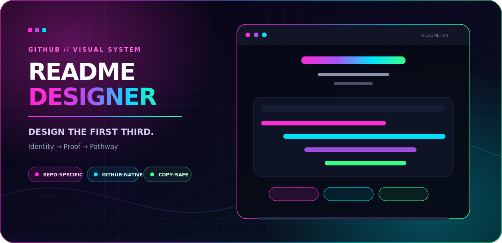

<p align="center">
  
</p>

<h1 align="center">GitHub README Designer</h1>

<p align="center">
  A portable Agent Skill for designing the part of a repository people see first.
</p>

<p align="center">
  <a href="SKILL.md"><strong>Explore the skill</strong></a>
  ·
  <a href="references/layout-patterns.md">Layout systems</a>
  ·
  <a href="references/visual-qa.md">Visual QA</a>
</p>

<p align="center">
  <a href="LICENSE"></a>
  <a href="https://agentskills.io"></a>
  
  
</p>

## The README is part of the product

Before someone reads the installation guide, they have already judged the project. The opening viewport establishes identity, confidence, and whether the repository feels worth exploring.

`github-readme-designer` gives coding agents a visual-design workflow built specifically for GitHub’s constrained Markdown canvas. It shapes hierarchy, imagery, screenshots, diagrams, badges, navigation, and document rhythm while keeping repository claims in the owner’s hands.

> The skill owns presentation. The repository owner owns the promise.

## What it designs

| Surface | Design responsibility |
|---|---|
| **Opening viewport** | Establish one focal point through identity, orientation, proof, and a clear next step. |
| **First third** | Turn the initial scroll into a deliberate progression instead of a pile of sections. |
| **Visual system** | Select a composition that fits the actual project: product, CLI, library, system, gallery, or research. |
| **Repository assets** | Place screenshots, diagrams, demos, and theme-aware imagery where they communicate best. |
| **Document rhythm** | Balance technical density with meaningful visual relief throughout the README. |
| **Rendered QA** | Check GitHub constraints, mobile behavior, dark mode, hierarchy, local assets, and badge density. |

### Six project-specific compositions

The skill chooses a starting system based on what the repository actually is:

1. **Product showcase** — interface-led apps and visual developer tools.
2. **Output-first tool** — CLIs, automation, linters, and terminal software.
3. **Developer library** — packages, SDKs, frameworks, and APIs.
4. **System map** — infrastructure, protocols, platforms, and integrations.
5. **Artifact gallery** — templates, themes, UI kits, icons, and collections.
6. **Research or benchmark** — papers, datasets, experiments, and model repositories.

These are composition systems, not fill-in-the-blank templates. The same visual formula should never be applied to unrelated projects.

## The workflow

```text
Inspect the repository
        │
        ▼
Define audience + first impression
        │
        ▼
Choose a project-specific composition
        │
        ▼
Design the opening viewport + first third
        │
        ▼
Create or refine repository-owned assets
        │
        ▼
Render, audit, and iterate
```

The skill inspects the current README, repository metadata, screenshots, logos, demos, and existing visual identity before choosing a direction. It does not reach for a generic banner first.

## What it refuses to fake

- Taglines, benefits, metrics, testimonials, or compatibility claims.
- Features, installation commands, or calls to action not supplied by the owner.
- CI, package, coverage, sponsor, download, or version badges without real backing data.
- Decorative images that misrepresent the interface or architecture.
- CSS, JavaScript, web fonts, or layout tricks GitHub will sanitize.

If a design needs missing copy, the skill leaves an invisible `OWNER` prompt instead of publishing filler.

## Install

The package follows the open [Agent Skills](https://agentskills.io) format: a `SKILL.md` plus progressively disclosed references and a small deterministic audit script.

### Codex

Repository-scoped:

```bash
git clone https://github.com/OpenCnid/github-readme-designer.git .agents/skills/github-readme-designer
```

Invoke it explicitly:

```text
$github-readme-designer Redesign this repository README around its existing copy and assets.
```

### Claude Code

Repository-scoped:

```bash
git clone https://github.com/OpenCnid/github-readme-designer.git .claude/skills/github-readme-designer
```

Invoke it explicitly:

```text
/github-readme-designer Redesign this repository README around its existing copy and assets.
```

### Other Agent Skills harnesses

Clone or copy the repository into the harness’s project or personal skills directory. The core skill uses only the portable `name` and `description` frontmatter fields. `agents/openai.yaml` adds optional Codex interface metadata without changing the shared workflow.

## Audit a README

The included script catches structural problems that are easy to miss while working in Markdown source:

```bash
python scripts/audit_readme.py path/to/README.md
```

It checks:

- H1 and heading hierarchy;
- badge density in the opening;
- unsupported CSS or script-dependent markup;
- excessive centered prose;
- missing local images and HTML alt attributes;
- visible placeholders and excessive remote-image dependencies.

The audit is dependency-free and intentionally complements—rather than replaces—a rendered desktop, mobile, light-theme, and dark-theme review.

## Inside the skill

```text
github-readme-designer/
├── SKILL.md                         # Core workflow and guardrails
├── agents/
│   └── openai.yaml                  # Optional Codex UI metadata
├── references/
│   ├── github-canvas.md             # GitHub rendering constraints
│   ├── layout-patterns.md           # Six composition systems
│   └── visual-qa.md                 # Rendered review checklist
└── scripts/
    └── audit_readme.py              # Dependency-free structural audit
```

## Design principles

- One dominant visual idea beats five competing elements.
- Real output beats ornamental illustration for developer tools.
- Repository-owned assets beat fragile hotlinks for core identity.
- Dark mode and narrow screens are part of the design, not afterthoughts.
- A beautiful README remains useful after the novelty wears off.

## License

Released under the [MIT License](LICENSE).
